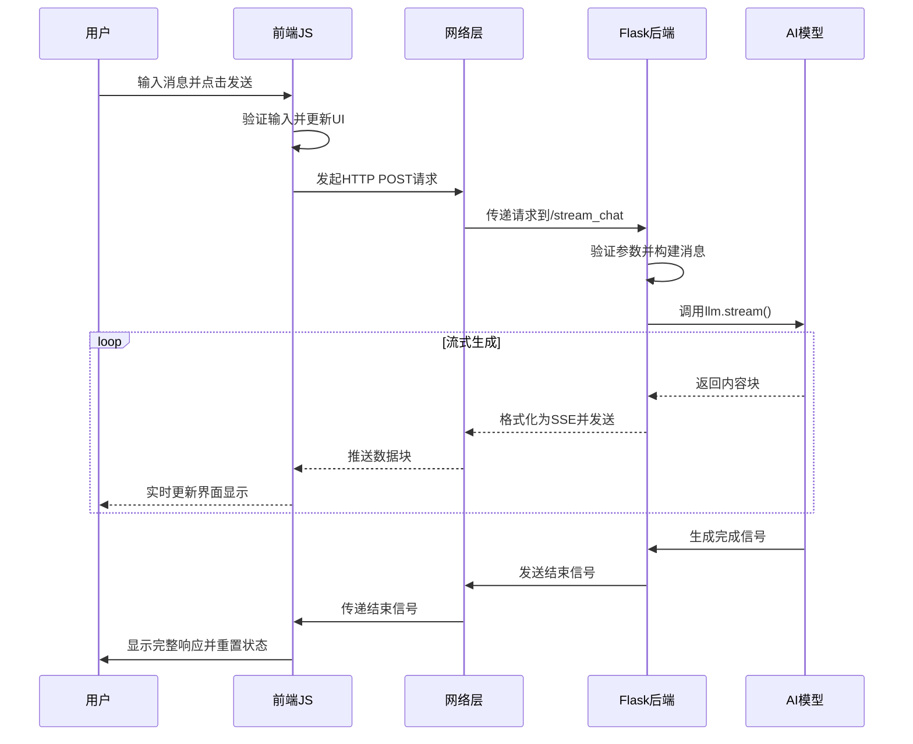

# 流式传输前后端联动深度解析

## 1. 技术背景与原理

### 1.1 什么是流式传输

流式传输（Server-Sent Events, SSE）是HTML5标准的一部分，它允许服务器主动向浏览器推送数据。与传统的请求-响应模式不同，SSE建立了一个持久的HTTP连接，服务器可以在这个连接上持续发送数据。

**传统模式 vs 流式传输：**

```
传统HTTP请求：
客户端 → 请求 → 服务器 → 完整响应 → 客户端

流式传输：
客户端 → 请求 → 服务器 → 数据块1 → 客户端显示
                      → 数据块2 → 客户端显示
                      → 数据块3 → 客户端显示
                      → 结束信号 → 连接关闭
```

### 1.2 SSE协议规范

SSE数据格式遵循特定的文本协议：

```
data: 这是第一行数据
data: 这是第二行数据

data: {"type": "message", "content": "JSON格式数据"}

event: custom-event
data: 自定义事件数据

id: 123
data: 带有ID的数据（用于断线重连）

retry: 3000
data: 设置重连间隔（毫秒）
```

**重要规则：**

- 每个数据字段以`data:`开头
- 消息之间用空行（`\n\n`）分隔
- 支持多行数据
- 可以包含事件类型、ID、重连时间等元数据

### 1.3 应用场景

- **AI对话系统**：实时显示AI生成的文本
- **实时通知**：系统消息推送
- **日志监控**：服务器日志实时展示
- **数据监控**：股价、订单状态等实时更新
- **协作应用**：多人在线编辑

## 2. 完整技术架构

### 2.1 系统组件图

```
┌─────────────────┐    ┌─────────────────┐    ┌─────────────────┐
│   前端浏览器     │    │   Flask后端     │    │   AI模型服务    │
│                │    │                │    │                │
│ ┌─────────────┐ │    │ ┌─────────────┐ │    │ ┌─────────────┐ │
│ │   用户界面   │ │    │ │  路由处理器  │ │    │ │  DeepSeek   │ │
│ │             │ │    │ │             │ │    │ │   Model     │ │
│ │ - 输入框     │ │    │ │ - 参数验证   │ │    │ │             │ │
│ │ - 发送按钮   │ │    │ │ - 消息构建   │ │    │ │ - 流式生成   │ │
│ │ - 聊天区域   │ │    │ │ - 错误处理   │ │    │ │ - Token输出  │ │
│ └─────────────┘ │    │ └─────────────┘ │    │ └─────────────┘ │
│                │    │                │    │                │
│ ┌─────────────┐ │    │ ┌─────────────┐ │    │                │
│ │  流处理器    │ │    │ │ 响应生成器   │ │    │                │
│ │             │ │    │ │             │ │    │                │
│ │ - 数据解析   │ │    │ │ - SSE格式化  │ │    │                │
│ │ - 状态管理   │ │    │ │ - 流式输出   │ │    │                │
│ │ - UI更新     │ │    │ │ - 连接维护   │ │    │                │
│ └─────────────┘ │    │ └─────────────┘ │    │                │
└─────────────────┘    └─────────────────┘    └─────────────────┘
        │                       │                       │
        │      HTTP POST        │      API调用          │
        │ ──────────────────────▶ ──────────────────────▶
        │                       │                       │
        │      SSE Stream       │      Stream Response  │
        │ ◀────────────────────── ◀──────────────────────
```

### 2.2 数据流转过程

```
1. 用户输入消息
   ↓
2. 前端JavaScript捕获输入
   ↓
3. 构建HTTP POST请求
   ↓
4. Flask接收并验证参数
   ↓
5. 调用AI模型API
   ↓
6. AI模型开始流式生成
   ↓
7. 后端将AI输出包装为SSE格式
   ↓
8. 通过HTTP响应流发送数据
   ↓
9. 前端ReadableStream接收数据
   ↓
10. JavaScript解析并更新DOM
    ↓
11. 用户看到实时更新的内容
```

## 3. 后端实现深度解析

### 3.1 Flask应用初始化

```python
from flask import Flask, render_template, request, Response
from langchain_deepseek import ChatDeepSeek
import json

# 创建Flask应用实例
app = Flask(__name__)

# 初始化AI模型
llm = ChatDeepSeek(
    model="deepseek-chat",
    temperature=0.7,           # 控制输出随机性
    max_tokens=2048,          # 最大输出token数
    timeout=30.0,             # 请求超时时间
    max_retries=2,            # 最大重试次数
    api_key="your-api-key"    # API密钥
)
```

**配置参数详解：**

- `temperature`: 0-1之间，值越大输出越随机
- `max_tokens`: 限制单次响应的最大长度
- `timeout`: 防止长时间等待，提升用户体验
- `max_retries`: 网络异常时的重试机制

### 3.2 路由设计模式

```python
@app.route('/stream_chat', methods=['POST'])
def stream_chat():
    """
    流式对话API端点
    
    接收参数：
    - message: 用户输入的消息内容
    
    返回：
    - text/event-stream格式的流式响应
    """
    try:
        # 1. 参数获取与验证
        user_message = request.form.get('message', '').strip()
        
        # 2. 输入验证
        if not user_message:
            return create_error_response("消息不能为空")
        
        # 3. 消息长度检查
        if len(user_message) > 1000:
            return create_error_response("消息过长，请控制在1000字符以内")
        
        # 4. 构建对话上下文
        messages = build_conversation_context(user_message)
        
        # 5. 创建流式响应
        return create_stream_response(messages)
        
    except Exception as e:
        # 6. 全局异常处理
        return handle_global_error(e)
```

### 3.3 核心生成器函数详解

```python
def generate():
    """
    流式数据生成器 - 这是整个系统的核心
    
    这个函数是一个Python生成器，它会：
    1. 逐步产生数据而不是一次性返回所有数据
    2. 自动处理内存管理
    3. 支持中断和恢复
    """
    
    # 用于累积完整响应内容
    full_content = ""
    
    # 用于统计和监控
    chunk_count = 0
    start_time = time.time()
    
    try:
        # 阶段1：发送开始信号
        start_data = {
            'type': 'start',
            'content': '',
            'timestamp': time.time(),
            'session_id': generate_session_id()
        }
        yield format_sse_data(start_data)
        
        # 阶段2：处理AI模型的流式输出
        for chunk in llm.stream(messages):
            # 提取chunk内容
            chunk_content = chunk.content if hasattr(chunk, 'content') else ""
            
            # 内容过滤和处理
            if chunk_content:
                # 累积完整内容
                full_content += chunk_content
                chunk_count += 1
                
                # 构建数据包
                chunk_data = {
                    'type': 'chunk',
                    'content': chunk_content,
                    'chunk_id': chunk_count,
                    'total_length': len(full_content)
                }
                
                # 发送数据块
                yield format_sse_data(chunk_data)
                
                # 性能监控：如果单个chunk过大，分割发送
                if len(chunk_content) > 100:
                    time.sleep(0.01)  # 防止前端处理不过来
            
            # 检查是否完成
            if is_generation_complete(chunk):
                break
        
        # 阶段3：发送完成信号
        end_data = {
            'type': 'end',
            'content': '',
            'full_content': full_content,
            'statistics': {
                'total_chunks': chunk_count,
                'total_characters': len(full_content),
                'generation_time': time.time() - start_time
            }
        }
        yield format_sse_data(end_data)
        
    except Exception as e:
        # 阶段4：错误处理
        error_data = {
            'type': 'error',
            'content': f'生成过程中出现错误: {str(e)}',
            'error_code': getattr(e, 'code', 'UNKNOWN'),
            'timestamp': time.time()
        }
        yield format_sse_data(error_data)

def format_sse_data(data):
    """
    格式化SSE数据
    
    将Python字典转换为符合SSE规范的文本格式
    """
    json_str = json.dumps(data, ensure_ascii=False)
    return f"data: {json_str}\n\n"

def is_generation_complete(chunk):
    """
    检查生成是否完成
    
    通过检查chunk的元数据来判断AI模型是否完成生成
    """
    if hasattr(chunk, 'response_metadata') and chunk.response_metadata:
        return chunk.response_metadata.get('finish_reason') is not None
    return False

```

```python
#大模型返回数据样式
# 生成过程中的chunk示例
chunk_1 = {
    "content": "人工",
    "response_metadata": {
        "finish_reason": None,  # None表示还在生成中
        "model": "deepseek-chat"
    }
}

chunk_2 = {
    "content": "智能",
    "response_metadata": {
        "finish_reason": None,  # 仍在生成
        "model": "deepseek-chat"
    }
}

# 最后一个chunk
final_chunk = {
    "content": "",  # 可能为空
    "response_metadata": {
        "finish_reason": "stop",  # 表示正常完成
        "model": "deepseek-chat",
        "usage": {...}
    }
}
```

### 3.4 响应头配置详解

```python
return Response(
    generate(),
    mimetype='text/event-stream',
    headers={
        # 核心SSE头
        'Cache-Control': 'no-cache',
        'Connection': 'keep-alive',
        
        # 代理服务器配置
        'X-Accel-Buffering': 'no',          # Nginx缓冲控制
        'X-Proxy-Buffering': 'no',          # 通用代理缓冲控制
        
        # CORS配置
        'Access-Control-Allow-Origin': '*',
        'Access-Control-Allow-Methods': 'POST',
        'Access-Control-Allow-Headers': 'Content-Type',
        
        # 安全头
        'X-Content-Type-Options': 'nosniff',
        'X-Frame-Options': 'DENY',
        
        # 自定义监控头
        'X-Stream-Version': '1.0',
        'X-Response-Type': 'streaming'
    }
)
```

**响应头作用详解：**

1. **`text/event-stream`**: 告诉浏览器这是SSE流，浏览器会自动处理
2. **`Cache-Control: no-cache`**: 防止CDN或代理缓存响应
3. **`Connection: keep-alive`**: 保持TCP连接，避免重复建连
4. **`X-Accel-Buffering: no`**: 禁用Nginx缓冲，确保数据立即推送
5. **CORS头**: 支持跨域请求（开发和生产环境）

## 4. 前端实现深度解析

### 4.1 请求发起机制

```javascript
async function sendMessage() {
    // 防重复提交
    if (isProcessing) {
        console.warn('正在处理中，请稍候...');
        return;
    }
    
    // 获取并验证输入
    const messageInput = document.getElementById('messageInput');
    const message = messageInput.value.trim();
    
    if (!message) {
        showUserFeedback('请输入消息内容', 'warning');
        return;
    }
    
    if (message.length > 1000) {
        showUserFeedback('消息过长，请控制在1000字符以内', 'error');
        return;
    }
    
    // 设置处理状态
    setProcessingState(true);
    
    // 显示用户消息
    addMessage('user', message);
    messageInput.value = '';
    
    try {
        // 发起流式请求
        await performStreamingRequest(message);
    } catch (error) {
        handleRequestError(error);
    } finally {
        setProcessingState(false);
    }
}

async function performStreamingRequest(message) {
    console.log('🚀 发起流式请求:', message);
    
    // 构建请求
    const response = await fetch('/stream_chat', {
        method: 'POST',
        headers: {
            'Content-Type': 'application/x-www-form-urlencoded',
            'Accept': 'text/event-stream',
            'Cache-Control': 'no-cache'
        },
        body: `message=${encodeURIComponent(message)}`
    });
    
    // 检查响应状态
    if (!response.ok) {
        throw new Error(`HTTP ${response.status}: ${response.statusText}`);
    }
    
    // 验证响应类型
    const contentType = response.headers.get('content-type');
    if (!contentType || !contentType.includes('text/event-stream')) {
        throw new Error('服务器返回了错误的内容类型');
    }
    
    // 开始处理流式数据
    await processStreamingResponse(response);
}
```

### 4.2 流式数据处理机制

```javascript
async function processStreamingResponse(response) {
    // 获取读取器
    const reader = response.body.getReader();
    const decoder = new TextDecoder('utf-8');
    
    // 用于处理不完整的数据
    let buffer = '';
    
    try {
        while (true) {
            // 读取数据块
            const { done, value } = await reader.read();
            
            if (done) {
                console.log('✅ 流式传输完成');
                break;
            }
            
            // 解码数据
            const chunk = decoder.decode(value, { stream: true });
            console.log('📦 收到数据块:', chunk);
            
            // 处理数据块（可能包含多个消息）
            buffer += chunk;
            buffer = processBuffer(buffer);
        }
    } catch (error) {
        console.error('❌ 读取流数据时出错:', error);
        throw error;
    } finally {
        // 释放读取器
        reader.releaseLock();
    }
}

function processBuffer(buffer) {
    // SSE消息以 \n\n 分隔
    const messages = buffer.split('\n\n');
    
    // 保留最后一个可能不完整的消息
    const incomplete = messages.pop();
    
    // 处理完整的消息
    for (const message of messages) {
        if (message.trim()) {
            parseSSEMessage(message);
        }
    }
    
    // 返回不完整的部分
    return incomplete || '';
}

function parseSSEMessage(message) {
    // 解析SSE消息格式
    const lines = message.split('\n');
    const data = {};
    
    for (const line of lines) {
        if (line.startsWith('data: ')) {
            const jsonStr = line.substring(6);
            try {
                const parsed = JSON.parse(jsonStr);
                Object.assign(data, parsed);
            } catch (e) {
                console.error('解析JSON失败:', e, jsonStr);
                return;
            }
        } else if (line.startsWith('event: ')) {
            data.event = line.substring(7);
        } else if (line.startsWith('id: ')) {
            data.id = line.substring(4);
        }
    }
    
    // 处理解析后的数据
    handleStreamData(data);
}
```

### 4.3 状态管理系统

```javascript
// 全局状态管理
const StreamState = {
    // 处理状态
    isProcessing: false,
    
    // 当前流式消息
    currentStreamingMessage: null,
    
    // 会话信息
    sessionId: null,
    
    // 统计信息
    statistics: {
        totalMessages: 0,
        totalChunks: 0,
        averageResponseTime: 0
    },
    
    // 设置处理状态
    setProcessing(processing) {
        this.isProcessing = processing;
        updateUIProcessingState(processing);
    },
    
    // 创建新的流式消息
    createStreamingMessage() {
        this.currentStreamingMessage = addStreamingMessage();
        return this.currentStreamingMessage;
    },
    
    // 完成当前流式消息
    finishStreamingMessage() {
        if (this.currentStreamingMessage) {
            finalizeStreamingMessage(this.currentStreamingMessage);
            this.currentStreamingMessage = null;
        }
    },
    
    // 更新统计信息
    updateStatistics(data) {
        if (data.statistics) {
            this.statistics = { ...this.statistics, ...data.statistics };
            updateStatisticsDisplay(this.statistics);
        }
    }
};

function handleStreamData(data) {
    console.log('🔄 处理流式数据:', data);
    
    // 更新会话ID
    if (data.session_id) {
        StreamState.sessionId = data.session_id;
    }
    
    switch (data.type) {
        case 'start':
            handleStreamStart(data);
            break;
            
        case 'chunk':
            handleStreamChunk(data);
            break;
            
        case 'end':
            handleStreamEnd(data);
            break;
            
        case 'error':
            handleStreamError(data);
            break;
            
        default:
            console.warn('未知的数据类型:', data.type);
    }
}

function handleStreamStart(data) {
    console.log('🟢 流式传输开始');
    
    // 创建流式消息容器
    const streamingMessage = StreamState.createStreamingMessage();
    
    // 显示打字指示器
    updateStreamingContent('<span class="typing-indicator">AI正在思考...</span>');
    
    // 更新UI状态
    showStreamingIndicator(true);
}

function handleStreamChunk(data) {
    console.log('📝 接收内容块:', data.content);
    
    // 移除打字指示器
    removeTypingIndicator();
    
    // 追加内容
    appendToStreamingMessage(data.content);
    
    // 更新统计信息
    StreamState.statistics.totalChunks++;
    
    // 自动滚动
    scrollToBottom();
}

function handleStreamEnd(data) {
    console.log('🏁 流式传输结束');
    
    // 完成流式消息
    StreamState.finishStreamingMessage();
    
    // 更新统计信息
    StreamState.updateStatistics(data);
    
    // 隐藏流式指示器
    showStreamingIndicator(false);
    
    // 重置状态
    StreamState.setProcessing(false);
    
    // 聚焦输入框
    focusInputField();
}

function handleStreamError(data) {
    console.error('💥 流式传输错误:', data);
    
    // 显示错误消息
    if (StreamState.currentStreamingMessage) {
        updateStreamingContent(`<span class="error">错误: ${data.content}</span>`);
        StreamState.finishStreamingMessage();
    } else {
        addMessage('error', data.content);
    }
    
    // 重置状态
    StreamState.setProcessing(false);
    showStreamingIndicator(false);
}
```

### 4.4 DOM操作优化

```javascript
// DOM操作工具函数
const DOMUtils = {
    // 批量DOM更新
    batchUpdate(updateFn) {
        requestAnimationFrame(() => {
            updateFn();
        });
    },
    
    // 安全的HTML插入
    safeSetHTML(element, html) {
        // 简单的XSS防护
        const cleanHtml = html
            .replace(/<script\b[^<]*(?:(?!<\/script>)<[^<]*)*<\/script>/gi, '')
            .replace(/javascript:/gi, '');
        
        element.innerHTML = cleanHtml;
    },
    
    // 平滑滚动
    smoothScrollTo(element, position) {
        element.scrollTo({
            top: position,
            behavior: 'smooth'
        });
    }
};

function addStreamingMessage() {
    const chatBox = document.getElementById('chatBox');
    const messageDiv = document.createElement('div');
    const uniqueId = 'streaming-' + Date.now() + '-' + Math.random().toString(36).substr(2, 9);
    
    // 设置消息结构
    messageDiv.className = 'message streaming-message';
    messageDiv.id = 'currentStreamingMessage';
    messageDiv.setAttribute('data-content-id', uniqueId);
    
    // 创建消息内容
    const messageHTML = `
        <div class="message-header">
            <strong>AI:</strong>
            <span class="stream-status">正在生成...</span>
        </div>
        <div id="${uniqueId}" class="message-content">
            <!-- 内容将在这里动态添加 -->
        </div>
        <div class="stream-info">
            <span class="chunk-count">已接收: 0 块</span>
            <span class="char-count">字符数: 0</span>
        </div>
    `;
    
    DOMUtils.safeSetHTML(messageDiv, messageHTML);
    
    // 添加到聊天框
    chatBox.appendChild(messageDiv);
    
    // 滚动到底部
    DOMUtils.smoothScrollTo(chatBox, chatBox.scrollHeight);
    
    return messageDiv;
}

function appendToStreamingMessage(content) {
    if (!StreamState.currentStreamingMessage) return;
    
    const contentId = StreamState.currentStreamingMessage.getAttribute('data-content-id');
    const contentElement = document.getElementById(contentId);
    
    if (contentElement) {
        // 批量更新DOM
        DOMUtils.batchUpdate(() => {
            // 追加内容
            const currentContent = contentElement.textContent || '';
            const newContent = currentContent + content;
            contentElement.textContent = newContent;
            
            // 更新统计信息
            updateStreamStatistics(contentElement, newContent);
            
            // 滚动到底部
            scrollToBottom();
        });
    }
}

function updateStreamStatistics(contentElement, content) {
    const message = contentElement.closest('.message');
    if (!message) return;
    
    const chunkCountElement = message.querySelector('.chunk-count');
    const charCountElement = message.querySelector('.char-count');
    
    if (chunkCountElement) {
        const chunkCount = StreamState.statistics.totalChunks;
        chunkCountElement.textContent = `已接收: ${chunkCount} 块`;
    }
    
    if (charCountElement) {
        charCountElement.textContent = `字符数: ${content.length}`;
    }
}
```

## 5. AI模型响应数据结构详解

### 5.1 LangChain流式响应对象结构

AI模型在流式生成过程中返回的每个chunk都遵循标准的数据结构，这是理解整个流式传输机制的基础：

```python
# AI模型返回的chunk对象通常包含以下结构：
class AIMessageChunk:
    def __init__(self):
        self.content = "这是生成的文本内容"  # 实际的文本内容
        self.response_metadata = {           # 元数据信息
            "finish_reason": None,           # 完成原因
            "model": "deepseek-chat",        # 模型名称
            "usage": {                       # 使用统计
                "prompt_tokens": 10,
                "completion_tokens": 50,
                "total_tokens": 60
            },
            "created": 1634567890,           # 创建时间戳
            "id": "response_123"             # 响应ID
        }
```

**数据结构关键字段说明：**

- `content`: 实际的文本内容，这是用户最终看到的文字
- `response_metadata`: 响应的元数据，包含状态和统计信息
- `finish_reason`: 生成完成的原因，是判断流式传输是否结束的关键
- `usage`: token使用统计，用于计费和性能监控
- `model`: 使用的AI模型名称
- `created`: 响应创建的时间戳

### 5.2 实际的chunk对象示例

在真实的流式生成过程中，chunk对象会经历不同的状态变化：

```python
# 生成过程中的chunk示例
chunk_1 = {
    "content": "人工",
    "response_metadata": {
        "finish_reason": None,  # None表示还在生成中
        "model": "deepseek-chat"
    }
}

chunk_2 = {
    "content": "智能",
    "response_metadata": {
        "finish_reason": None,  # 仍在生成
        "model": "deepseek-chat"
    }
}

# 最后一个chunk
final_chunk = {
    "content": "",  # 可能为空
    "response_metadata": {
        "finish_reason": "stop",  # 表示正常完成
        "model": "deepseek-chat",
        "usage": {
            "prompt_tokens": 15,
            "completion_tokens": 25,
            "total_tokens": 40
        }
    }
}
```

**chunk状态演进过程：**

1. **生成中chunk**: `content`有内容，`finish_reason`为`None`
2. **中间chunk**: 继续输出内容，状态保持`None`
3. **结束chunk**: `content`可能为空，`finish_reason`有明确值

### 5.3 完整的数据流转示例

```python
def demonstrate_chunk_evolution():
    """演示chunk数据结构在生成过程中的变化"""
    
    # 模拟AI模型的完整响应序列
    simulated_chunks = [
        {
            "content": "人工",
            "response_metadata": {
                "finish_reason": None,
                "model": "deepseek-chat",
                "id": "resp_001"
            }
        },
        {
            "content": "智能",
            "response_metadata": {
                "finish_reason": None,
                "model": "deepseek-chat",
                "id": "resp_001"
            }
        },
        {
            "content": "是未来",
            "response_metadata": {
                "finish_reason": None,
                "model": "deepseek-chat",
                "id": "resp_001"
            }
        },
        {
            "content": "的趋势",
            "response_metadata": {
                "finish_reason": None,
                "model": "deepseek-chat",
                "id": "resp_001"
            }
        },
        {
            "content": "",  # 最后一个chunk内容通常为空
            "response_metadata": {
                "finish_reason": "stop",  # 关键：完成标志
                "model": "deepseek-chat",
                "id": "resp_001",
                "usage": {
                    "prompt_tokens": 20,
                    "completion_tokens": 8,
                    "total_tokens": 28
                },
                "created": 1634567890
            }
        }
    ]
    
    full_response = ""
    
    for i, chunk_data in enumerate(simulated_chunks):
        print(f"\n--- Chunk {i+1} ---")
        print(f"内容: '{chunk_data['content']}'")
        print(f"完成状态: {chunk_data['response_metadata']['finish_reason']}")
        
        # 累积内容
        if chunk_data['content']:
            full_response += chunk_data['content']
            print(f"累积响应: '{full_response}'")
        
        # 检查是否完成
        if chunk_data['response_metadata']['finish_reason'] is not None:
            print(f"🎉 检测到完成信号: {chunk_data['response_metadata']['finish_reason']}")
            print(f"📊 Token使用统计: {chunk_data['response_metadata'].get('usage', {})}")
            break
```

### 5.4 不同AI模型的差异

不同的AI模型提供商可能在数据结构上有细微差异：

```python
# OpenAI风格的chunk
openai_chunk = {
    "content": "文本内容",
    "response_metadata": {
        "finish_reason": "stop",
        "model": "gpt-4",
        "usage": {
            "prompt_tokens": 10,
            "completion_tokens": 20,
            "total_tokens": 30
        }
    }
}

# DeepSeek风格的chunk
deepseek_chunk = {
    "content": "文本内容", 
    "response_metadata": {
        "finish_reason": "stop",
        "model": "deepseek-chat",
        "usage": {
            "prompt_tokens": 10,
            "completion_tokens": 20,
            "total_tokens": 30
        }
    }
}

# Anthropic Claude风格的chunk
claude_chunk = {
    "content": "文本内容",
    "response_metadata": {
        "stop_reason": "end_turn",  # 注意：字段名可能不同
        "model": "claude-3",
        "usage": {
            "input_tokens": 10,
            "output_tokens": 20
        }
    }
}
```

### 5.5 健壮的chunk处理函数

基于这些数据结构特点，我们可以编写更健壮的处理函数：

```python
def process_chunk_safely(chunk):
    """安全处理不同格式的chunk对象"""
    
    try:
        # 提取内容
        content = getattr(chunk, 'content', '') or chunk.get('content', '')
        
        # 提取元数据
        metadata = getattr(chunk, 'response_metadata', {}) or chunk.get('response_metadata', {})
        
        # 标准化完成原因字段（兼容不同模型）
        finish_reason = (
            metadata.get('finish_reason') or 
            metadata.get('stop_reason') or 
            metadata.get('completion_reason')
        )
        
        # 提取模型信息
        model = metadata.get('model', 'unknown')
        
        # 提取使用统计
        usage = metadata.get('usage', {})
        
        return {
            'content': content,
            'finish_reason': finish_reason,
            'model': model,
            'usage': usage,
            'is_complete': finish_reason is not None
        }
        
    except Exception as e:
        print(f"❌ 处理chunk时出错: {e}")
        return {
            'content': '',
            'finish_reason': None,
            'model': 'unknown',
            'usage': {},
            'is_complete': False
        }

# 使用示例
def handle_ai_stream():
    """处理AI流式响应的标准流程"""
    
    for chunk in llm.stream(messages):
        # 安全解析chunk
        parsed = process_chunk_safely(chunk)
        
        # 处理内容
        if parsed['content']:
            print(f"📝 接收内容: {parsed['content']}")
            # 发送给前端
            yield format_sse_data({
                'type': 'chunk',
                'content': parsed['content'],
                'model': parsed['model']
            })
        
        # 检查完成状态
        if parsed['is_complete']:
            print(f"✅ 生成完成，原因: {parsed['finish_reason']}")
            print(f"📊 使用统计: {parsed['usage']}")
            
            # 发送完成信号
            yield format_sse_data({
                'type': 'end',
                'finish_reason': parsed['finish_reason'],
                'usage': parsed['usage']
            })
            break
```

## 6. 联动流程深度分析

### 5.1 初始化阶段

```javascript
// 1. 页面加载完成
document.addEventListener('DOMContentLoaded', function() {
    console.log('🎯 初始化流式传输界面...');
    
    // 初始化状态
    StreamState.reset();
    
    // 绑定事件监听器
    bindEventListeners();
    
    // 设置键盘快捷键
    setupKeyboardShortcuts();
    
    // 聚焦输入框
    focusInputField();
    
    // 显示欢迎消息
    showWelcomeMessage();
    
    console.log('✅ 界面初始化完成');
});

function bindEventListeners() {
    // 发送按钮点击
    document.getElementById('sendBtn').addEventListener('click', sendMessage);
    
    // 输入框回车
    document.getElementById('messageInput').addEventListener('keypress', handleKeyPress);
    
    // 窗口关闭前清理
    window.addEventListener('beforeunload', cleanupResources);
    
    // 网络状态监听
    window.addEventListener('online', handleNetworkOnline);
    window.addEventListener('offline', handleNetworkOffline);
}
```

### 5.2 请求构建阶段

```javascript
function buildStreamRequest(message) {
    // 1. 消息预处理
    const processedMessage = preprocessMessage(message);
    
    // 2. 构建请求体
    const requestBody = new URLSearchParams({
        message: processedMessage,
        session_id: StreamState.sessionId || '',
        timestamp: Date.now(),
        user_agent: navigator.userAgent,
        timezone: Intl.DateTimeFormat().resolvedOptions().timeZone
    });
    
    // 3. 构建请求头
    const headers = {
        'Content-Type': 'application/x-www-form-urlencoded',
        'Accept': 'text/event-stream',
        'Cache-Control': 'no-cache',
        'X-Requested-With': 'XMLHttpRequest',
        'X-Client-Version': '1.0.0'
    };
    
    // 4. 添加认证信息（如果需要）
    const authToken = getAuthToken();
    if (authToken) {
        headers['Authorization'] = `Bearer ${authToken}`;
    }
    
    return {
        method: 'POST',
        headers: headers,
        body: requestBody.toString()
    };
}

function preprocessMessage(message) {
    // 清理输入
    let processed = message.trim();
    
    // 移除危险字符
    processed = processed.replace(/[<>]/g, '');
    
    // 限制长度
    if (processed.length > 1000) {
        processed = processed.substring(0, 1000) + '...';
    }
    
    return processed;
}
```

### 5.3 数据传输阶段



### 5.4 错误处理流程

```javascript
// 多层次错误处理策略
const ErrorHandler = {
    // 网络错误
    handleNetworkError(error) {
        console.error('🌐 网络错误:', error);
        
        if (error.name === 'TypeError' && error.message.includes('Failed to fetch')) {
            showUserFeedback('网络连接失败，请检查网络设置', 'error');
        } else if (error.name === 'AbortError') {
            showUserFeedback('请求被取消', 'warning');
        } else {
            showUserFeedback('网络请求出错，请稍后重试', 'error');
        }
        
        this.resetState();
    },
    
    // 解析错误
    handleParseError(error, data) {
        console.error('📋 数据解析错误:', error, data);
        showUserFeedback('服务器返回了无效数据', 'error');
        this.resetState();
    },
    
    // 服务器错误
    handleServerError(errorData) {
        console.error('🔥 服务
```
